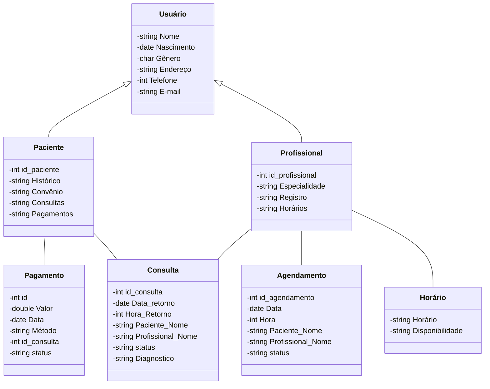

# SIG-CLINIC
Repositório voltado para a criação do projeto SIG-CLINIC na linguagem de programação C++, o presente projeto propõe um sistema capaz de auxiliar no agendamento de consultas dos pacientes, gerenciando profissionais vinculados à clínica, horários e pagamentos de consultas, convênios e exibindo relatórios de atendimento.

## Modelo Conceitual

### Diagrama de Classes usando Mermaid

### Descrição das Entidades

Descrição sucinta das entidades presentes no sistema.

| Entidade | Descrição |
|----------|-----------|
| Usuário  | A entidade usuário será responsável por representar o papel de usuário no sistema, tendo os atributos... e os métodos... |
| Paciente | O paciente representará o paciente da clínica e herda os atributos e métodos da classe Usuário... |
| Profissional | O profissional representará o profissional da clínica e herda os atributos e métodos da classe Usuário... |
| Agendamento | No agendamento um profissional capacitado irá agendar uma consulta no horário disponível e requisitado pelo paciente, seus atributos e métodos são... |
| Consulta | Na consulta o profissional preencherá todas as informações cabiveis a cerca do paciente, realizará a consulta, dará um diagnostico e marcará o retorno, seus atributos e métodos são... | 
| Pagamento | No pagamento o paciente irá escolher um método de pagamento e irá pagar pela consulta requisitada, seus atributos e métodos são... |
| Horário | Os horários serão informados pelos profissionais para facilitar o agendamento de consultas, seus atributos e métodos são... |